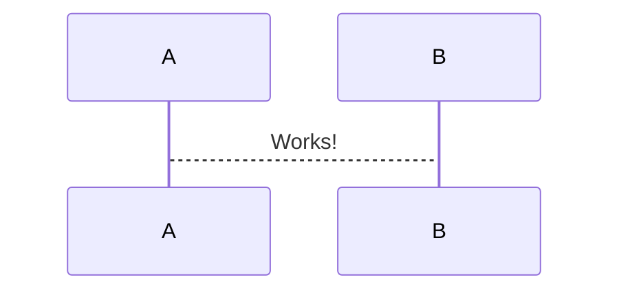

<p align="center">
    
</p>

<p align="center">
    Easily generate .docx files with JS/TS. Works for Node and on the Browser. :100:
</p>

---

# Welcome

## Installation

# Liens

```markdown
[remoteMarkdownUrl](https://raw.githubusercontent.com/docsifyjs/docsify/develop/docs/README.md)


